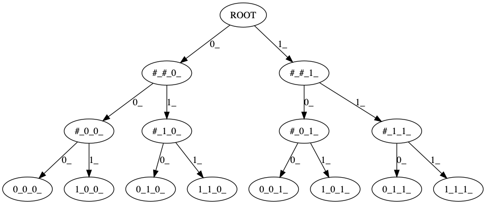

# Reinforcement Learning Environments

This package is to simplify life for doing RL experiments by providing easily generatable RL environments that can be used to test out RL algorithms.

This is still work in progress, however, hopefully this will serve as a useful feature for exact RL experiments in a reproducible, light-weight and scientific manner.

---
## Getting Started.

### Installation
#### Installing with PyPi
```bash
pip3 install rlenvs
```

#### Installing from source
```
git clone https://github.com/ai-nikolai/rl-environments
cd rl-environments
pip3 install -e .
```

### Examples:

#### Bandit
```python
from rlenvs.bandits import MultiarmBernoulliBandit

env = MultiarmBernoulliBandit(arms=5)

reward, observation, is_finished, internal_state = env.step(0) #picks arm 0
```

#### Tree MDP
```python
from rlenvs.mdps import BalancedDenseTreeDeterministicMDP

env = BalancedDenseTreeDeterministicMDP(branching=3, depth=5) #creates a tree with 3 choices each turn and a total of 5 turns.

reward, observation, is_finished, internal_state = env.step(3) #picks arm 0
```
This is how such an environment would look like:


---
## Documentation:
### Overview:
Overall, this package provides environments, whose API is quite similar to the environments provided by Deepmind and OpenAI. (for interoperability.)

That is the interface provided by every environment:
```python
class BaseEnvironment(object):
    """
    Implements the following methods inspired by both OpenAI gym and Deepmind Bsuite (dm_env).
    :initialise() -> observation, resets and initialises the environment and returns first observation:
    :step(action) -> reward(float), observation(Optional[Any]), is_finished(bool), state(Optional[Any]):
    :reset() -> "resets the environement":
    :undo() -> "goes to the previous state of the environment" reward, observation, is_finished(bool), sate(Optional[Any]):
    :go_to_state(state) -> "goes to a specific state of the environment" is_finished(bool):
    :seed(int) -> "sets the seed":
    :render() -> "renders the environment":
    :get_specs() -> returns the custom specs of the environment:
    """
```


---
## Troubleshooting / FAQs:

### Requirements: (What are the requirements):
In the future this will hopefully be configurable
```
python >= 3.6
networkx
graphviz
...
```


## Copyright (C) - Nikolai Rozanov 2020-Present
